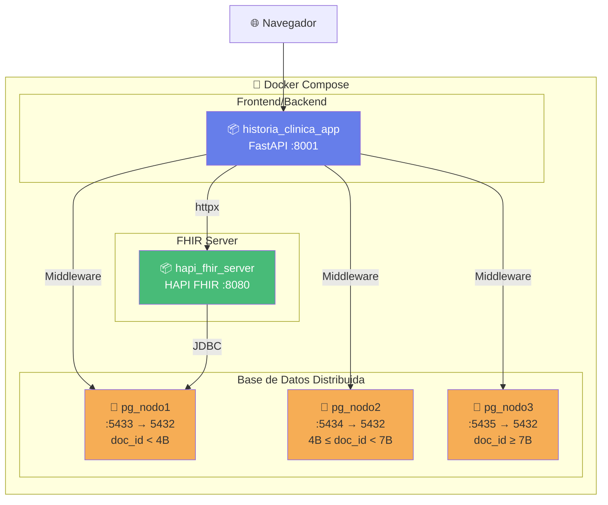
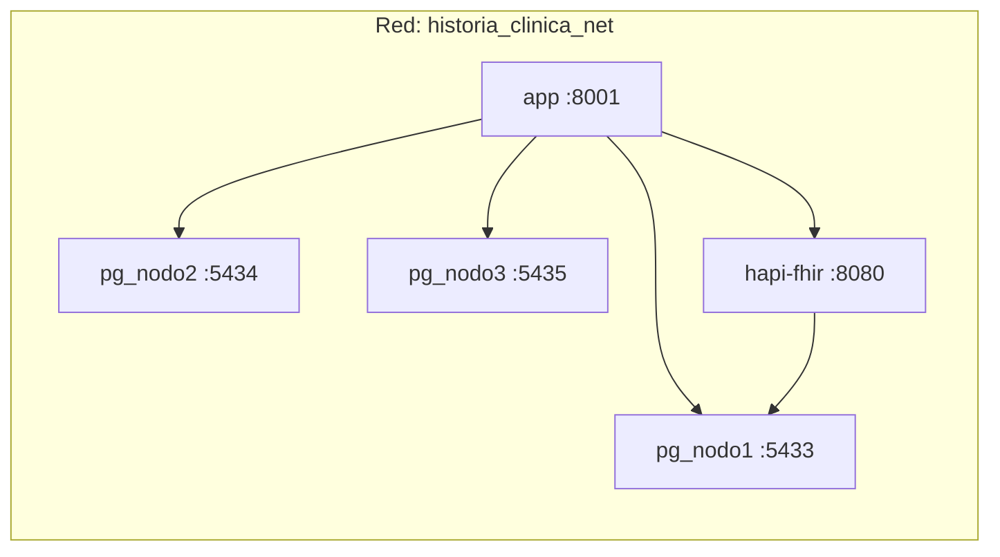
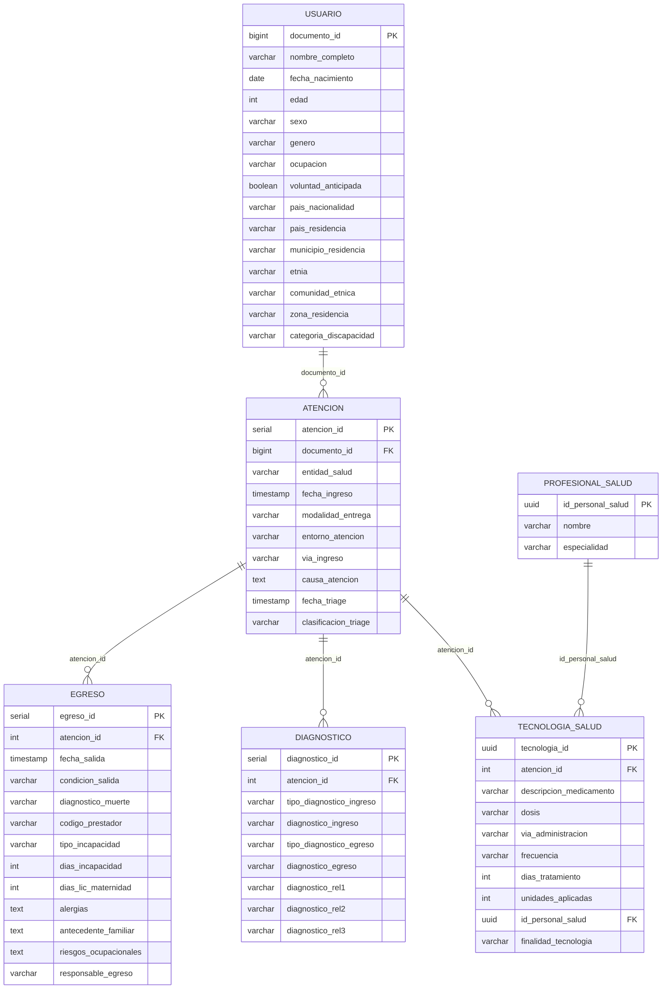

# 🏥 Estructura Completa del Proyecto — Historia Clínica Distribuida

## Visión General

Este es un **sistema de historia clínica distribuida** construido en Python (FastAPI) que simula una base de datos distribuida usando **3 nodos PostgreSQL independientes** con fragmentación horizontal por `documento_id`. Además integra **HAPI FHIR Server** para interoperabilidad con el estándar HL7 FHIR R4, siguiendo la normativa colombiana (Resolución 866 de 2021 — los 57 campos de HC).

---

## Diagrama de Arquitectura



---

## 📁 Árbol de Archivos Completo

```
HISTORIA_CLINICA_DISTRIBUIDA/
│
├── 🐍 APLICACIÓN PRINCIPAL
│   ├── app.py                          # API FastAPI — punto de entrada principal
│   ├── middleware.py                    # Lógica de consultas distribuidas
│   └── requirements.txt                # Dependencias Python
│
├── 🧬 BACKEND FHIR (Patrón MVC)
│   └── backend/
│       ├── __init__.py
│       └── fhir_app/
│           ├── __init__.py
│           ├── models/
│           │   ├── __init__.py
│           │   └── patient_model.py    # Modelo Pydantic: 15 campos de identificación
│           ├── services/
│           │   ├── __init__.py
│           │   └── fhir_service.py     # Cliente HTTP hacia HAPI FHIR Server
│           └── transformers/
│               ├── __init__.py
│               └── fhir_transformer.py # Convierte datos colombianos → FHIR R4
│
├── 🌐 FRONTEND
│   ├── templates/
│   │   ├── index.html                  # Dashboard principal (monitoreo de nodos)
│   │   ├── firh.html                   # Formulario FIRH dinámico (57 campos)
│   │   ├── registro-paciente.html      # Formulario registro paciente FHIR
│   │   └── consulta-hc.html           # Lista/búsqueda de pacientes FHIR
│   └── static/
│       ├── style.css                   # Estilos del dashboard
│       └── script.js                   # JS del dashboard (polling, queries)
│
├── 🐳 INFRAESTRUCTURA DOCKER
│   ├── Dockerfile                      # Imagen Python 3.11-slim para la app
│   ├── docker-compose.yml              # Orquestación: app + HAPI + 3 nodos PG
│   ├── .dockerignore                   # Archivos excluidos del build
│   ├── init-databases.sh              # Script para cargar esquemas SQL
│   └── verificar-docker.sh            # Script de diagnóstico
│
├── 🗄️ ESQUEMAS SQL (uno por nodo)
│   ├── nodo1.sql                       # Fragmento: doc_id < 4,000,000,000
│   ├── nodo2.sql                       # Fragmento: 4B ≤ doc_id < 7B
│   └── nodo3.sql                       # Fragmento: doc_id ≥ 7,000,000,000
│
├── 📚 DOCUMENTACIÓN
│   ├── README.md                       # Documentación principal
│   ├── 57_CAMPOS_HC.md                # Especificación de los 57 campos (Res. 866)
│   ├── DOCKER.md                      # Guía Docker
│   ├── EJECUTANDO.md                  # Guía de ejecución
│   ├── INDICE.md                      # Índice de documentos
│   ├── INICIO_RAPIDO_FHIR.md         # Quickstart FHIR
│   ├── MODULO_CONSULTA_HC.md          # Documentación módulo consulta
│   ├── MVP_FHIR_IMPLEMENTADO.md       # Documentación del MVP FHIR
│   ├── PLAN_TRABAJO_FHIR.md          # Plan de trabajo
│   ├── RESUMEN_IMPLEMENTACION.md     # Resumen de implementación
│   └── SOLUCION_PROBLEMAS.md         # Troubleshooting
│
└── 🔧 OTROS
    ├── package.json                    # Metadatos Node (para .nvmrc)
    ├── .nvmrc                          # Versión de Node
    ├── .gitignore                      # Archivos ignorados por Git
    ├── debug_docker.py                # Script de depuración Docker
    └── test-mvp-fhir.sh              # Script de pruebas FHIR
```

---

## 🔍 Explicación Detallada de Cada Componente

### 1. `app.py` — API FastAPI Principal (573 líneas)

Es el **corazón del sistema**. Contiene todos los endpoints HTTP.

| Ruta | Método | Función |
|------|--------|---------|
| `/` | GET | Dashboard principal (HTML) |
| `/hc`, `/firh`, `/carga-hc` | GET | Formulario FIRH de 57 campos |
| `/registro-paciente` | GET | Formulario registro FHIR |
| `/consulta-hc` | GET | Listado/búsqueda de pacientes |
| `/paciente/{id}` | GET | Detalle de un paciente FHIR |
| `/api/health` | GET | Health check |
| `/api/nodes` | GET | Estado de los 3 nodos PostgreSQL |
| `/api/nodes/{id}/{action}` | POST | Control de nodos (informativo) |
| `/api/execute-query` | POST | Ejecutar SQL en todos los nodos |
| `/api/firh/campos` | GET | Definición de los 57 campos |
| `/api/firh/cargar` | POST | Insertar registro en nodo correcto |
| `/api/v1/fhir/patient` | POST | Crear paciente en HAPI FHIR |
| `/api/v1/fhir/patient/{id}` | GET | Obtener paciente por ID |
| `/api/v1/fhir/patient/search/{doc}` | GET | Buscar por documento |
| `/api/v1/fhir/patients` | GET | Listar pacientes paginados |
| `/api/v1/fhir/patients/search` | GET | Buscar por nombre/documento |
| `/api/v1/fhir/health` | GET | Health check del servidor FHIR |

> [!IMPORTANT]
> La app tiene **dos sistemas paralelos** para manejar pacientes:
> 1. **Sistema FIRH directo**: Inserta en los 3 nodos PostgreSQL con fragmentación manual
> 2. **Sistema FHIR**: Envía datos al servidor HAPI FHIR (que usa `pg_nodo1` como backend)

**Configuración de nodos** (líneas 38-52): La app detecta si corre en Docker (`USE_DOCKER_NAMES=true`) para usar nombres de contenedores internos o `localhost` con puertos mapeados.

---

### 2. `middleware.py` — Coordinador de Consultas Distribuidas (107 líneas)

Contiene **dos funciones clave**:

#### `ejecutar_query_en_todos_los_nodos(query)`
- Recibe una consulta SQL
- La ejecuta en **los 3 nodos** simultáneamente
- **Agrega los resultados** de todos los nodos en una sola lista
- Reporta el estado (UP/DOWN) de cada nodo
- Maneja fallos: si un nodo está caído, continúa con los demás

#### `insertar_registro_firh(tabla, datos)`
- Implementa la **fragmentación horizontal**
- Determina el nodo destino según `documento_id`:

```
documento_id < 4,000,000,000     → Nodo 1 (:5433)
4,000,000,000 ≤ doc_id < 7B     → Nodo 2 (:5434)
documento_id ≥ 7,000,000,000     → Nodo 3 (:5435)
```

- Construye el `INSERT INTO` dinámicamente
- Retorna en qué nodo se insertó el registro

---

### 3. Backend FHIR — `backend/fhir_app/`

Implementa el patrón **Modelo-Servicio-Transformador** para interoperar con HAPI FHIR.

#### `models/patient_model.py` — Modelo de Datos
Define `PatientIdentificationData` con **los 15 campos de identificación** de la Resolución 866:

| Campo | Tipo | Obligatorio |
|-------|------|-------------|
| tipoDocumento | str | ✅ |
| numeroDocumento | str | ✅ |
| paisNacionalidad | str | ✅ |
| nombreCompleto | str | ✅ |
| fechaNacimiento | date | ✅ |
| edad | int (0-150) | ✅ |
| unidadEdad | str | default "1" |
| sexo | str | ✅ |
| genero | str | ❌ |
| ocupacion | str | ❌ |
| voluntadAnticipada | str | ❌ |
| categoriaDiscapacidad | str | ❌ |
| paisResidencia | str | ✅ |
| municipioResidencia | str | ✅ |
| etnia | str | ❌ |

#### `transformers/fhir_transformer.py` — Transformador a FHIR R4
Convierte los datos colombianos a un recurso **FHIR Patient**:
- Mapea tipos de documento colombianos (CC, TI, CE, PA, RC, MS, AS) a códigos FHIR
- Crea `Identifier`, `HumanName`, `Address` con códigos DANE
- Agrega extensiones FHIR para: nacionalidad, ocupación, etnia, discapacidad y género

#### `services/fhir_service.py` — Cliente HAPI FHIR
Usa `httpx` (HTTP async) para comunicarse con el servidor HAPI FHIR en `http://hapi-fhir:8080/fhir`. Operaciones:
- `create_patient()` — POST /Patient
- `get_patient()` — GET /Patient/{id}
- `search_patient_by_identifier()` — GET /Patient?identifier=...
- `update_patient()` — PUT /Patient/{id}
- `delete_patient()` — DELETE /Patient/{id}
- `check_server_health()` — GET /metadata

---

### 4. Frontend — `templates/` + `static/`

#### `index.html` — Dashboard Principal
- Muestra las **tarjetas de estado** de los 3 nodos PostgreSQL (running/exited)
- Incluye una **consola SQL** para ejecutar queries distribuidos
- Usa polling cada 3 segundos para actualizar estados

#### `firh.html` — Formulario FIRH (57 campos)
- Genera campos **dinámicamente** desde `/api/firh/campos`
- 6 secciones colapsables: usuario, atención, tecnología en salud, diagnóstico, egreso, profesional
- Envía datos sección por sección a `/api/firh/cargar`

#### `registro-paciente.html` — Registro FHIR (15 campos)
- Formulario estático con los campos de identificación
- Calcula la edad automáticamente desde la fecha de nacimiento
- Envía a `/api/v1/fhir/patient` para crear en HAPI FHIR

#### `consulta-hc.html` — Consulta de Pacientes
- Lista pacientes paginados desde HAPI FHIR
- Búsqueda por nombre o documento
- Muestra estadísticas (total de pacientes)
- Enlace a detalle individual de cada paciente

---

### 5. Infraestructura Docker

#### `docker-compose.yml` — 5 Servicios



| Servicio | Imagen | Puerto Ext | Dependencias |
|----------|--------|------------|--------------|
| `app` | Build local (Dockerfile) | 8001 | pg_nodo1, pg_nodo2, pg_nodo3 |
| `hapi-fhir` | hapiproject/hapi:latest | 8080 | pg_nodo1 (usa `fhir_db`) |
| `pg_nodo1` | postgres:15 | 5433 | — |
| `pg_nodo2` | postgres:15 | 5434 | — |
| `pg_nodo3` | postgres:15 | 5435 | — |

- **Credenciales**: `admin/admin` (desarrollo)
- **Volúmenes**: `pg_data_nodo1`, `pg_data_nodo2`, `pg_data_nodo3` para persistencia
- **Health checks**: Cada nodo usa `pg_isready`, HAPI usa `curl /fhir/metadata`
- **HAPI FHIR** almacena sus datos en `fhir_db` dentro de `pg_nodo1`

#### `Dockerfile`
```
Python 3.11-slim → gcc + postgresql-client → pip install → uvicorn app:app :8001
```

---

### 6. Esquemas SQL — `nodo1.sql`, `nodo2.sql`, `nodo3.sql`

Los 3 archivos son **idénticos en estructura** (cada nodo tiene todas las tablas). La diferencia es conceptual: cada nodo almacena solo el rango de `documento_id` que le corresponde.

#### Modelo de Datos (6 tablas)



---

## 🔄 Flujos de Datos Principales

### Flujo 1: Consulta SQL Distribuida
```
Navegador → POST /api/execute-query → middleware.ejecutar_query_en_todos_los_nodos()
     → Conecta a pg_nodo1, pg_nodo2, pg_nodo3
     → Ejecuta el mismo SQL en cada uno
     → Agrega resultados + estado de nodos
     → Retorna JSON al navegador
```

### Flujo 2: Registro de Paciente FIRH (57 campos)
```
Navegador → POST /api/firh/cargar { tabla, datos }
     → middleware.insertar_registro_firh()
     → Determina nodo por documento_id
     → INSERT INTO tabla en el nodo correcto
     → Retorna confirmación con nodo usado
```

### Flujo 3: Registro de Paciente FHIR (15 campos)
```
Navegador → POST /api/v1/fhir/patient { 15 campos }
     → PatientIdentificationData (validación Pydantic)
     → FHIRTransformer.to_fhir_patient() (conversión a FHIR R4)
     → FHIRService.create_patient() (HTTP POST a HAPI FHIR)
     → HAPI FHIR almacena en fhir_db (dentro de pg_nodo1)
     → Retorna patient_id FHIR
```

### Flujo 4: Consulta de Pacientes FHIR
```
Navegador → GET /api/v1/fhir/patients?page=1&size=10
     → httpx GET http://hapi-fhir:8080/fhir/Patient
     → Extrae pacientes del Bundle FHIR
     → Retorna lista paginada
```

---

## 📦 Dependencias Python

| Paquete | Versión | Propósito |
|---------|---------|-----------|
| `fastapi` | 0.109.0 | Framework web API |
| `uvicorn` | 0.27.0 | Servidor ASGI |
| `psycopg2-binary` | 2.9.9 | Driver PostgreSQL |
| `pydantic` | 2.5.3 | Validación de datos |
| `fhir.resources` | 7.1.0 | Modelos FHIR R4 en Python |
| `httpx` | 0.26.0 | Cliente HTTP async (para HAPI FHIR) |

---

## 🚀 Cómo se Levanta Todo

```bash
# 1. Levantar infraestructura
docker compose up -d

# 2. Cargar esquemas SQL en los 3 nodos
./init-databases.sh

# 3. Acceder a la aplicación
#    Dashboard:           http://localhost:8001
#    Formulario FIRH:     http://localhost:8001/hc
#    Registro FHIR:       http://localhost:8001/registro-paciente
#    Consulta pacientes:  http://localhost:8001/consulta-hc
#    HAPI FHIR:           http://localhost:8080
#    API Docs:            http://localhost:8001/docs
```

---

## Resumen de Páginas Web

| URL | Descripción | Tecnología |
|-----|-------------|------------|
| `/` | Dashboard con tarjetas de nodos + consola SQL | Polling + Fetch API |
| `/hc` o `/carga-hc` | Formulario dinámico de 57 campos (6 secciones) | Campos desde API |
| `/registro-paciente` | Formulario estático de 15 campos → HAPI FHIR | POST a FHIR API |
| `/consulta-hc` | Tabla paginada + búsqueda de pacientes FHIR | GET desde HAPI |
| `/paciente/{id}` | Detalle individual con recurso FHIR completo | HTML generado en Python |
